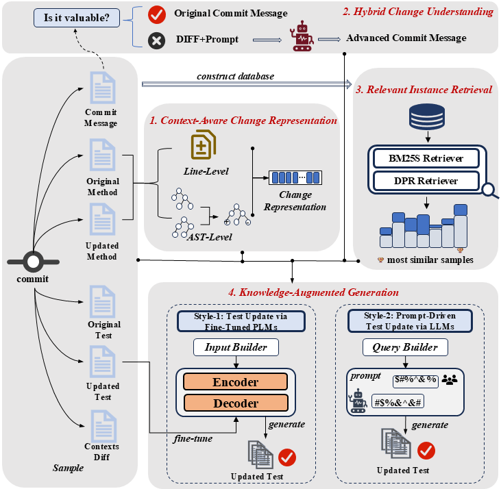

# _KATE_

_**KATE**_ (_**K**nowledge-**A**ugmented-**T**est **E**volution_), a novel technique that harnesses the power of knowledge-augmented LMs to automate the process of updating tests when the production code undergoes changes.

<p align="center">
  <span style="font-size: 20px; font-weight: bold;">Overview of KATE</span>
</p>
<p align="center">
  
</p>

## 1. Environment

The main libraries used are as follows:

    codebleu                  0.2.1
    tree-sitter               0.21.3
    python                    3.8.19
    torch                     1.10.1+cu113
    torchaudio                0.10.1+cu113
    torchvision               0.11.2+cu113

For additional dependencies, please refer to **requirements.txt**.

## 2. KATE-Offline Model training and validation

Our offline method is based on pytorch. The core code is placed in the KATE/offline folder. The important files are as follows:

- **evaluator**: BLEU score configuration
- **config.py**: Model configuration files
- **model.py**: Model architecture of KATE
- **pre_train.py**: Fine-tuning the model for domain awareness
- **run.py**: Configure and train the model based on incoming data

To train our model, you need to do the following:

**STEP1: Base Model Preparation**

Download the pre-trained PLM weight file from open-source websites such as [Hugging Face](https://huggingface.co/) and place it in the following directory:

```text
./KATE/offline/model/
```

**STEP2: Dataset Splitting**

Use the provided data or your own data to split into training, validation, and test sets as needed for your experiments.

**STEP3: Experiment Configuration**

Open `config.py` and set the relevant parameters, such as:

- Learning rate
- Batch size
- Number of epochs
- Model architecture options

The default values in `config.py` are those used in our experiments. Adjust them as needed for your specific setup.

**STEP4: Training**

Run the following command to start training:

```bash
python run_rapgen.py \
  --edit edit,ast \
  --output_dir ./output \
  --do_pre_train \
  --use_best_commit \
  --do_train \
  --do_eval \
  --do_test \
  --gpu 0 \
  --pre_train_batch_size 1
```

- **--edit**: Specifies the type of code changes to use.
- **--output_dir**: Directory where all training-related files (model checkpoints, log files, etc.) will be saved. (e.g., `./output`)
- **--do_pre_train**: Whether to perform Adaption Training for Code Change Representation.
- **--use_best_commit**: Whether to use the best commit messages. If not specified, the default commit messages will be used.
- **--do_train**: Enable the training phase.
- **--do_eval**: Enable the evaluation phase during training.
- **--do_test**: Enable the test phase after training.
- **--gpu**: GPU device index to use (e.g., `0`).
- **--pre_train_batch_size**: Batch size for the pre-training phase.

**STEP5: Evaluation**

You can evaluate the trained model by running the following command:

```bash
python run_rapgen.py \
  --edit edit,ast \
  --output_dir ./output \
  --use_best_commit \
  --do_test \
  --gpu 0
```

You can specify which model checkpoint to evaluate (e.g., 'best-codebleu', 'best-em', 'best-codebleu-em', 'best-ppl') by modifying the relevant configuration in the `run.py` file.

The implementation of the baseline method can be found at https://github.com/CEPROTest/CEPROT and https://github.com/SQUARE-RG/SynTeR

## 3. KATE-Online

Our online method is based on OpenAI. The core code is placed in the KATE/Online folder.

1. **get_prompt.py**: This script demonstrates how to construct prompts using our provided data. You can also modify or design your own prompts according to your specific requirements.
2. **query.py**: This script allows you to interact with the model using your own API key and model selection. You can specify your preferred model and key to perform inference or querying tasks.

## 4. About the Data

We have placed all the data collected and reviewed during the experiment in the ./data/ directory.

The data.jsonl file contains all the data we collected during our experiments. Each line in this file represents a single sample, stored in JSON format. You can split the data into training, validation, and test sets according to your own rules.Due to the large size of the data, it has been compressed into ./data/data.zip. Please extract the contents before use.
Each sample is stored as a JSON object, with the following keys:

- **rep_name_1**: Repository name of the main sample
- **commit_1**: Commit hash of the main sample
- **rep_name_2**: Repository name of the retrieved (reference) sample
- **commit_2**: Commit hash of the retrieved (reference) sample
- **commit_message**: Commit message for the main sample
- **best_commit_message**: The best selected commit message for the main sample
- **edit_seq**: Line-level diff between code versions
- **dependency**: Import (dependency) differences between versions
- **field**: Field-level differences between versions
- **ast_edit_seq**: AST-level diff between code versions
- **test_src**: Test code before the change (old version)
- **test_tgt**: Test code after the change (new version)
- **refer_test_src**: Test code before the change in the reference sample
- **refer_test_tgt**: Test code after the change in the reference sample

The directory `./data/200_example_check` contains our RQ1 analysis results, with a total of 200 samples.  
Each sample is assigned a unique index and is categorized according to the reason for LLM-based test evolution failure, corresponding to TABLE-1 in our paper.  
For each sample, we provide:

- The GitHub commit link.
- The paths to the production and test functions, in the format `fileName#methodName`.
- The old and new versions of the test code.
- The test code generated by the LLM.
